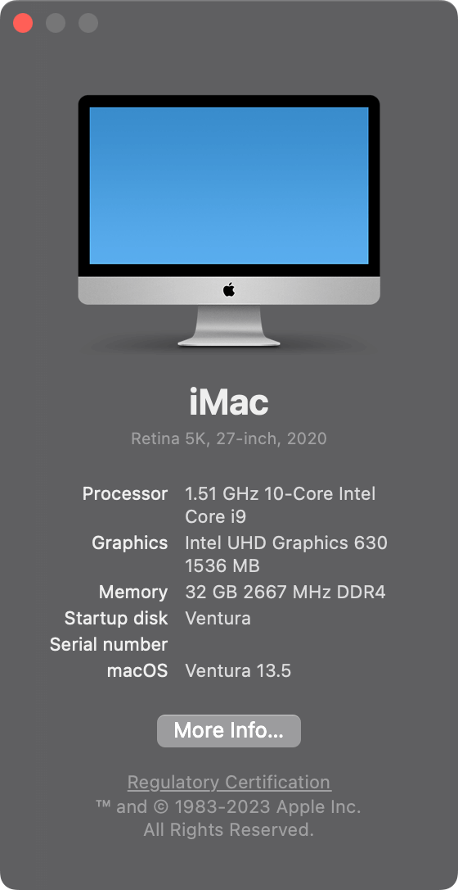
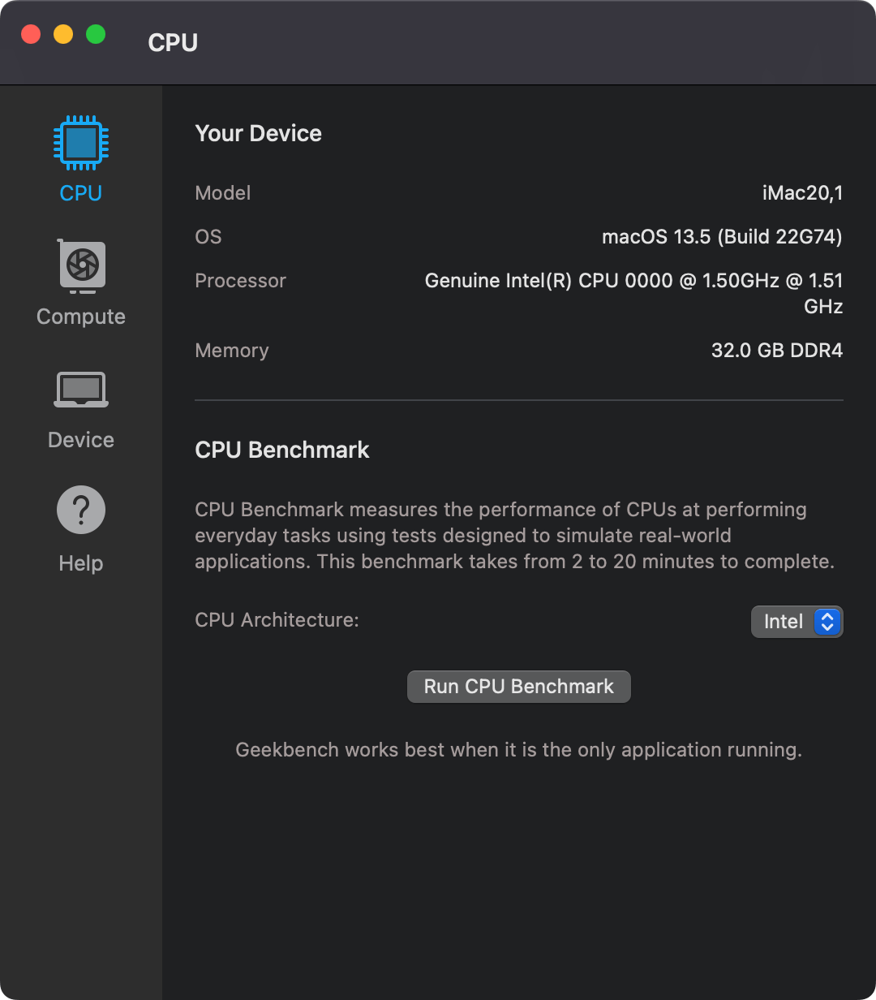
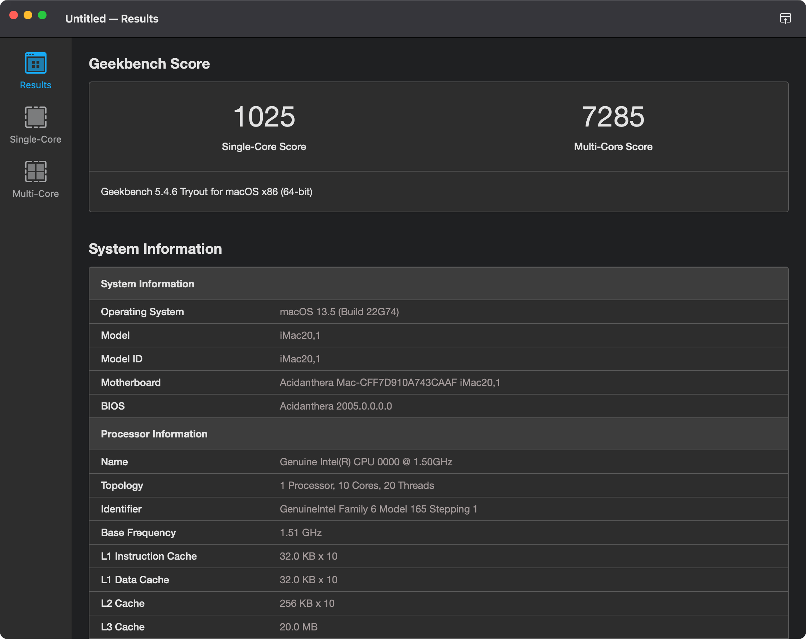

## ASRock Deskmini H470 Hackintosh OpenCore EFI

### [简体中文](README.zh_CN.md)


### OpenCore

[OpenCore 0.9.7](https://github.com/acidanthera/OpenCorePkg)


### macOS

- Ventura
- Monterey
- Big Sur
- Catalina


### Spec

- Chipset: ASRock H470
- CPU: Intel i9-10900T ES (QTB0)
- Cooler: NOCTUA NH-L9i
- Memo: Samsung 16GB DDR4 2666 Mhz
- iGPU: Intel UHD Graphic 630
- HDA: Realtek ALC233
- SSD: WD SN750 512G
- LAN: Intel
- WLAN: BCM94360CS2


### BIOS

```
Security
    |---- Security Boot: disabled
Boot
    |---- Fast Boot: disabled
```


### Issues

- Only one monitor works when the system starts with dual monitors are connected at the same time. Solution: Turn on only one monitor before startup, and turn on another after the system on.


### Notes
 - Use [OpenCore Configurator](https://mackie100projects.altervista.org/opencore-configurator/) build your SMBIOS
 - U Must Use CFGLock.efi Tool Unlock CFG LOCK first


### Screenshot








### Kexts

- [Lilu.kext 1.6.7](https://github.com/acidanthera/Lilu)
- [SMCProcessor.kext 1.3.2](https://github.com/acidanthera/VirtualSMC)
- [SMCSuperIO.kext 1.3.2](https://github.com/acidanthera/VirtualSMC)
- [VirtualSMC.kext 1.3.2](https://github.com/acidanthera/VirtualSMC)
- [WhateverGreen.kext 1.6.6](https://github.com/acidanthera/WhateverGreen)
- [AppleALC.kext 1.8.8](https://github.com/acidanthera/AppleALC)
- [IntelMausi.kext 1.0.7](https://github.com/acidanthera/IntelMausi)


### Tools

- [Hackintool](https://github.com/headkaze/Hackintool) 
- [OCAuxiliaryTools](https://github.com/ic005k/OCAuxiliaryTools) AKA `OCAT`.
- [OpenCore Configurator](https://mackie100projects.altervista.org/opencore-configurator/) AKA `OCC`.
- [GenSMBIOS](https://github.com/corpnewt/GenSMBIOS) Generate SMBIOS.
- [MountEFI](https://github.com/corpnewt/MountEFI) Mount EFI partition.
- [EFI Agent](https://github.com/headkaze/EFI-Agent) Better EFI partition mount App.
- [gibMacOS](https://github.com/corpnewt/gibMacOS) Build your own MacOS image.
- [ProperTree](https://github.com/corpnewt/ProperTree) Plist editor.


### Contact Us

 - [Hackintosh.Club](https://hackintosh.club/) 
 - QQ Group: 23304408 
 
